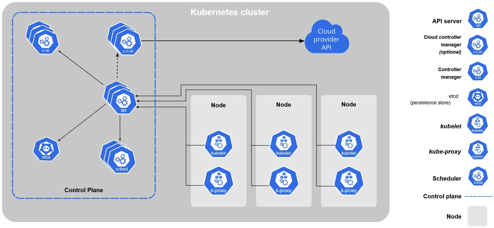

# CI/CD Pipeline

## Увод

Као одговор на потребу за алтернативом документацијом вођене процесе развоја софтвера, од 11. до 13. фебруара 2001. године у The Lodge at Snowbird скијалишту у планинама Wasatch у Јути састало се седамнаест људи са намером да покушају да нађу ову алтернативу. Резултат тог састанка је документ "Agile manifesto" који су потписали сви учесници састанка. Од овог тренутка креће агилни развој софтвера. Из агилног развоја софтвера настаје и методологија DevOps. DevOps је бесконачна петља која се састоји из планирања, кодирања, изградње, тестирања, испоруке, поставке, коришћења и надгледања софтвера. Кључни део DevOps методологије је CI/CD. CI/CD представља комбинацију пракси континуиране интеграције и континуиране испоруке.

Од 9. 11. 1945. када је Греј Хопер пронашла мољца заробљеног између пинова на релеју #70, панел F, релејног калкулатора Mark II Aiken Relay Calculator приликом његовог тестирања на Универзитету Харвард постоје "багови". За време софтверске кризе, 1980их, квалитет софтвера постаје примарни циљ. Развија се софтверско инжењерство као област, а са њом и тестирање софтвера као њена подобласт. Mercury, Mariner1, Фокландски рад, Сан Франциско 1989 - смрт петогодишњег дечака, Тексас септембар 1990 - IRS USA, ToysRUs Disasters (1999-2000), eBay Disaster (1999), Victoria's Secret Disaster (1999) само су неки од примера великих и скупоцених софтверских грешака.

## Тестирање

Тестирање је један од најважнијих процеса у развоју софтвера, на који се троши од 40% до 70% укупног времена развоја. Користи се за процену исправности функционалности и квалитете програма. Веома је важно, јер софтверске грешке могу узроковати велике финансијске и људске губитке. По моделу водопада налази се након имплементације, а пре испоруке. Док се код агилних модела тестирање завршава у истој итерацији с програмирањем.

Иако се чини једноставним, прецизно дефинирање појма 'тестирање' је изазовно. Врло је важно тaчно и прецизно га дефинисати због даљег приступа у писању тестова и постизања што веће коректности и поузданости софтвера. Дефиниције попут "Тестирање је демонстрација да грешке нису присутне", "Сврха тестирања је да програм покаже да исправно обавља своје предвиђене функције", "Тестирање је процес успостављања поверења да програм ради оно што би требало да ради" иако делују на први поглед тачне. итеткако су погрешне. Наводе нас на погрешан пут да мислимо да је циљ тестирања доказивање да софтвер ради коректно, а запрваво циљ тестирања је откривање грешака. Зато једно од исправних дефиниција софтвер гласи: 
> "Тестирање је процес извршавања програма са намермом да се пронађу грешке."
>
Ова дефиниција нам помаже у неколико проблема и из људске психлогије:

>**"Тестирање је демонстрација да грешке нису присутне."**
> 
Обзиром да смо до сад кроз историју развоја софтвера научили да је немогуће направити софтвер који нема грешке. А студије психологије су нам показале да су људи много продуктивнији када решавају решиви проблем. Рећићемо да је тестирање процес проналаска грешака, што је итекако могуће постићи.

>**Тестирање је процес успостављања поверења да програм ради оно што би требало да ради.**
>
Сви желимо да нам се програм понаша контролисано. Односно да ради оно што би требало да ради и да не ради оно што не би требало да ради. На пример, брисање слога у бази можемо решити тако што ћемо обрисати само тај слог, а можемо и обрисати целу базу. Тај слог ће бити обрисан свакако, али ста ће бити са осталим подацима који су нам потребни? 
>**"Сврха тестирања је да програм покаже да исправно обавља своје предвиђене функције."**
> 
Бавећи се само исправним понашањем, скрећемо фокус са проблема. Уместо да се суочимо са проблемом и признамо да има грешака. Полазимо од тога и тразимо сто више грешака.

Такође треба и разграничити појмове успешан и неуспешан тест. Тест који је прошао не значи и да је успешан. Успешан је онај тест који пронађе грешку или наког чијег извршења се утврди да више нема грешке. Јер нам је циљ да пронађемо грешке, а не да докажемо да програм исправно ради. А само они тестови који не тестирају програм на прави начин су неуспешни тестови. Јер су одузели време тестеру да их направи и одузимају ресурсе приликом њиховог покретања.

### Подела тестирања по нивоима
* **Компонентно (Унит) тестирање** - тестирају се модули или компоненте изоловани од остатка софтвера како би се потврдило очекивано понашање.
* **Интеграционо тестирање** - тестирају се интерфејси између више компонената приликом интеграције компоненти. Постоје два приступа top-down и bottom-up, која се комбинују користећи предности оба приступа.
* **Тестирање система** - зове се и end-to-end (Е2Е) тестирање, када се све интегрише, тестира се комплетан софтвер. Овде се откривају и нефункционалне грешке.

## Технике и технологије

### Континуирана интеграција
Континуирана интеграција (CI) је основа модерног развоја софтвера. То није само део процеса, већ читав начин размишљања који радикално мења организацију целокупног развоја софтвера од једноставне аутоматизоване изградње до континуиране
испоруке софтвера у продукцију. Добро организована конитинуирана интеграција поједностављује процес развоја све до имплементације, помаже у бржем откривању и поправљању грешака, обезбеђује корисну контролну таблу како програмерима тако и
онима који то нису, а најважније је да помаже тимовима у испоруци веће вредности софтвера крајњим корисницима. Данас би требао сваки развојни тим, ма колико био мали, да практикује континуирану интерграцију.

Од почетка тимског развоја софтвера програмери су увек трошили време на интеграцију промена у софтвер. Био је ово јако тежак посао који је носио ризике попут измене старог кода, кашњења испоруке, непланираних трошкова, незадовољства
клијената, ... Континуирана интеграција је ту да реши ове проблеме. Најпростија континуирана интеграција је алат који прати промене у систему за верзионисање кода, када дође до промене, аутоматски компајлира и тестира апликацију и обавести
програмере о успешности компајлирања и тестирања. Поред овога, континуирана интеграција омогућава праћење стања базе кодова, аутоматски надгледа квалитет кода и метрику покривености кода и помаже у смањењу техничког дуга и смањивању
трошкова одржавања. Покретањем аутоматских е2е прихватних тестова редовно извештава о тренутном стању развоја софтвера. А поврх свега, може у потпуности аутоматизовати процес имплементације нове верзије апликације крањим корисницима.

Аутоматизацијом испоруке софтвера крајњем корснику, могуће је испоручити сваку верзију која прође неопходне аутоматизоване тестове. Овај процес је познат под називом continius deployment. Међутим, овај процес није увек употребљив. Неки
корисници не би волели да констатно добијају нове верзије већ да их добијају ређе, али стабилније верзије. Маркетинг и бизнис правила такође могу одредити када треба да изађе новија верзија софтвера.

Континуирана интеграција није само скуп алата већ и начин размишљања. Да би се извукако максимум њених бенефита, тим треба да усвоји читав менталитет који CI доноси са собом. Попут тога да пројекти морају имати аутоматизован процес изградње,
без интервенције човека. Поправљање неуспелих изградњи софтвера би требало да има апсолутни приоритет. Такође, цео процес имплементације мора бити у потпуности аутоматизован, без икаквих ручних корака. А главна ствар је квалитет аутоматизованих
тестова, тако да тим мора ставити велики акценат на квалитет и праксе тестирања. 

Неки од алата за континуирану интеграцију су Apache Gump, Azure DevOps Server, CircleCI, GitLab, Travis CI, Jenkins, ...

#### Jenkins
Jenkins је алат отвореног кода за континуирану интеграцију написан у Јава програмском језику, а издаје се под МИТ лиценцом. Пројекат се првобитно звао Hudson, али после спора са Oracle -ом назван је Jenkins. Оригинални аутор је Kohsuke Kawaguchi. Са доминатним тржишним уделом, користе га тимови свих величина, а подржава пројекете на разним језицима, попут .NET, Java, Groovy, PHP, NodeJS, ... Зашто користити Jenkins као CI алат?

Прво, једноставан је за коришћење. Кориснички интерфејс је једноставан, интуитиван и визуелно привлачан, а сам Jenkins у целини има веома ниску криву учења.

А поред овога, Jenkins је моћан и проширив, изузетно флексибилан и лако се прилагођава свим потребама. Доступно је више стотина додатака отвореног кода за Jenkins, које се редовно ажурирају. Додаци су намењени свему, од система за контролу верзија, алата за изградњу, метрика за квалитет кода, слање обавештења развојним тимовима, интеграцију са спољним системима, прилагођавању корисничког интерфејса, играма, ... а њихова инталација је веома брза и проста.

Jenkins -овој популарности свакако доприсноси и величина и активност његове заједнице, са скоро 800 сарадника на пројекту. Недељно излазе нова издања са најновијим функцијама, исправкама грешака и ажурирањем додатака. А за кориснике који више воле стабилност од великог темпа издавања нових верзија, Jenkins нуди и дугорочну подршку LTS, са изласцима нових верзија на око 3 месеца. Овакак концепт подсећа на Ubuntu LTS издања.

Предности:

* **Континуирана интеграција и континуирана испорука** - као прошириви сервер за аутоматизацију, Jenkins се може користити као једноставни CI сервер или претворити у чвориште континуиране испоруке за било који пројекат.
* **Једноставна инсталација** - Jenkins је самостални програм застован на Јави, спреман за рад без употребе, са пакетима за Windows, Linux, macOS и остале оперативне системе засноване на Unix -у.
* **Једноставна конфигурација** - Jenkins се може лако подесити и конфигурисати преко свог web интерфејса, који укључује провере грешака у лету и уграђену помоћ.
* **Додаци** - са стотинама додатака, Jenkins се интегрише са практично сваким алатом у ланцу алата за континуирану интеграцију и континуирану испоруку.
* **Проширивост** - Jenkins се може проширити преко његове архитектуре додатака, пружајући скоро бесконачне могућности за оно што Jenkins може да уради.
* **Дистрибуираност** - Jenkins може лако да дистрибуира посао на више машина, помажући брже у изградњи, тестирању и примени на више платформи.

#### Jenkins Pipeline
Jenkins Pipeline омогућава коришћење Jenkins -а и за континуирану испоруку, а представља скуп Jenkins -ових додатака. Континуирана испорука је аутоматизовани процес од преузимања софтвера од система за контролу верзија до испоруке крањим корисницима. Свака промена пролази кроз сложен процес да би стигла до коначне испоруке укључујући изградњу софтвера, више фаза тестирања и поставку. Jenkins pipeline пружа скуп алата за моделирање испоруке од једноставних до сложених процеса као код језика DSL, намењеног за такве потребе.

Дефинција самог Pipeline -а се налази у текстуалној датотеци која се зове Jenkinsfile и може се налазити заједно са пројектом на систему за верзионисање кода, а представља основу "Pipeline-as-code", односно третирања континуиране испоруке као дела апликације који треба верзионисати и прегледати као и сваки други код. Неке од предности Jenkinsfile -а и његовог чувања на систему за верзионисање кода су: Аутоматски креира процес изградње pipeline -а за све гране и pull request -ове; преглед и интеграција кода у Pipeline, заједно са осталим кодом апликације; ревизорски траг за Pipeline; јединствено место за Pipeline, који могу да виде и уређују више чланова пројекта. Иако постоји могућност дефинисања Pipeline -а преко web корисничког интерфејса, ипак је добра пракса дефинисати Pipeline у Jenkinsfile -у и поставити Jenkinsfile у пројекат на систему за верзионисање кода. 

Постоје два типа синтаксе за Jenkinsfile: декларативни и скриптни. Фундаментално другачија, декларативна синтакса је новија верзија која пружа богатије синтаксне карактеристике, а и лакше се чита и пише код помоћу ње. Али и многе синтаксе компоненте синтаксе у Jenkinsfile -у су заједничке и за декларативни и за скриптни тип.

Jenkins је у основи механизам за аутоматизацију који подржава бројне процесе аутоматизације. А Pipeline додаје многе алате за аутоматизацију Jenkins -у, од најпростијих континуираних интеграција до најсложенијих CD процеса. Повезивањем низа задатака, корисници могу да користе многе функције Pipeline -а, а главне предности су:
* **Код**: Pipeline -ови се пишу као и сваки други код, често се стављају на систем за контролисање верзија, где их тимови могу уређивати, прегледавати и итерирати крој свој Pipeline.
* **Издржљивост**: Pipeline -ови преживљавају и планирана, а и непланирана поновна покретања Jenkins контролера.
* **Паузирање**: Jenkins -ови имају могућност заустављања и чекања на унос корисника или одобрење пре него што наставе са својим извршењем.
* **Разноврснот**: Подржавају сложене захтеве које доноси реални процес CD, укључујући принцип fork/join, петље и паралелизацију посла.
* **Проширљивост**: Пипелине додатак подржава и проширења за свој DSL, као и опције за интеграцију са осталим додацима.

Pipeline такође подржава једну од главних вредности Jenkins -а, проширивост. Могу га проширити и корисници са дељеним библиотекама за Pipeline, али и креатори Jenkins додатака.

Концепти Pipeline -а:
* **Pipeline** - корснички дефинисан модел CD процеса. Код обично дефинише цео процес CD, који обично обухвата изграђу, тестирање и испоруку апликације.
* **Node** - машина која је може да изврши Pipeline, а део је Jenkins -овог окружења. У скриптном Pipeline -у, блок Node је кључни део.
* **Stage** - представља логички подскуп задатака који се обављају.
* **Step** - говори шта Jenkins треба да уради у одређеном тренутку, нешто попут наредбе у коду.

### Контејнеризација
Контејнер је стандардна јединица софтера која пакује код и све зависности тако да апликација ради брзо и поуздано из једног рачунарског окружења у другом. Контејнери изолују софтвер од његовог окружења и обезбеђују да ради уједначено упркос разликама у окружењу, на пример, између развоја и фазе. 

Ове карактеристике омогућавају нам да суштински променимо начин развоја, дистрибуције и покретања софтвера. Бенефите виде програмери који не морају водити рачуна о окружењу, јер ће се апликација идентично понашати без обизира на окружење домаћина, било да је на кластеру у облаку или на лаптопу корисника. А поред програмера и оперативним инжењерима олакшава посао померајући њихов фокус на умрежавање, ресурсе и време доступности, штедећи им време потребно за конфигурацију окружења и борбу са системским зависностима. У читавој индустрији, употреба контејнера рапидно расте, од најмањих предузећа до огромних компанија. Чини се да је контенјеризација постаје некако стандард за савремене апликације. Најпростије речено, контејнери су запакована апликација са својим зависностима.

Иако на први поглед контејнери делују као да су лагани облик виртуелних машина, јер садрже изоловани оперативни систем који се може користити за покретање апликација. Контејнери ипак имају своје предности у одређеним ситуацијама у односу на виртуелне машине:
* Деле ресурсе са оперативним системом домаћина, што их чини за ред величине ефикаснијим. Покрећу се и заустављају у делићу секунде, а контејнеризоване апликације захтевају минимално додатних трошкова у односу на апликације које се покрећу класично на матичном оперативном систему.
* Преносивост контејнера елиминише читав скуп грешака изазваних променама у окружењу у коме се извршава апликације. Елиминацијом ових грешака елиминише се и чувена програмерска реченица "али на мом рачунару то ради".
* Растерећеност контејнера омогућава програмерима покретање десетина или стотина контејнера у исто време, чиме се емулира дистрибуирани систем спреман за испоруку крајњем кориснику. А оперативни инжењери на истој машини могу покренути много више контејнера него виртуелних машина.
* Поред својих предности коришћења контејнера у облаку, имају и предности за крајње кориснике омогућавајући им преузимање и покретање сложене апликације без губљења времена на конфигурацију и инсталацију и без бриге о променама потребним за њихов систем. А програмери не морају водити рачуна о разликама у корисничком окружењу и доступним зависностима.

Иако слични, основни циљеви контејнера и виртуелних машина се разликују. Циљ контејнера је да учини апликације преносивим и самосталним, а циљ виртуелних машина је да симулира страно окружење.

Слика 1 приказује 3 апликације које се извршавају у посебним виртуелним машинама. Hypervisor је потребан за управљање виртуелним машинама, контролу приступа основном оперативном систему и хардверу, као и тумачењу системских позива по потреби. У свакој виртуелној машини се налази цела копија оперативног система, апликација која се покреће и све библиотеке које су јој потребне.

Слика 2 приказаује исте 3 апликације које су покренуте у контејнерима. Сви контејнери раде у корисничком режиму и деле међусобно језгро домаћина, што значи да контејнери морају покретати исто језгро као и домаћин. На пример, ако домаћин користи Ubuntu, у контејнеру се може покренути Rocky, али не и Windows. Из тог разлога виртуелизација контејнера се често назива и виртуелизација на нивоу оперативног система. Алпикације 2 и 3 користе исте библиотеке, које деле међусобно, уместо да свака апликација има засебну копију. Engine контејнера је задужен за управљање контејнерима као што је hypervisor задужен за управљање виртуелним машинама. А процеси који се покрећу унутар контејнера су исти као и процеси који се покрећу на домаћину, не изазивајући додатне трошкове за разлику од hypervisor -а. 

Иако се контјнери могу користити за изолацију апликација од других апликација које раде на истој машини. Ипак виртуелне машине имају додатни степен изолације од hypervisor -а и представљају поузданију и безбеднију технологију за виртуелизацију. Али контејнери имају мању површину напада од целокупног оперативног система, а и немају посредника који се може напасти.

Једна од главних примена контејнера су свакако микросервиси. Микросервис је мала, аутономна компонента која обавља одређену функционалост и може се независно развијати, тестирати, имплементирати и скалирати, а са осталим компонентама међусобно комуницира преко мреже. Омогућавају хоризонтално скалирање, додавањем више машина у систем, за разлику од монолитних апликација које захтевају вертикално скалирање, додавањем више RAM -а или CPU -а у једну машину. Поред могућности хоризонталног скалирања, микросервиси омогућавају и скалирање само потребних делова, фокусирајући се на уска грла у систему, уместо целе апликације, што је случај код монолитних апликација. Микросервис јесте проста компонента, али микросервисна апликација је компликованија због међусобне интеракције између микросервиса. Контејнери са својом лакоћом и брзином покретања су идеални за покретање микросервисне архитектуре, омогућавајући микросервисној архитектури минималну алокацију ресурса и брз одговор на промене у оптерећењу.

#### Docker
Концепт контејнера постоји одавно, још од UNIX -а постоји команда chroot која обезбеђује просту изолацију фајл система. FreeBSD је 1998. године увео програм који је проширио chroot изолацију на процесе. Solaris нуди Solaris Zones готово комплетну технологију за контејнеризацију 2001. године ограничену само на Solaris оперативни систем. Parrallels Inc, tada SWsoft, издао је комерцијални програм Virtuozzo за Linux контејнере, а 2005. програм отвореног кода под именом OpenVZ. Google започиње развој CGroups за Linux -ово језгро и креће са контејнеризацијом својих апликација. Године 2008. почиње да се развија пројекат Linux Containers (LXC) који обезбеђује комплетно решење за контењеризацију обједињујући Google -ов Cgroups, језгрове просторе имена и chroot програм.

Коначно, компанија Docker Inc ствара Docker који заокружује контејнеризацију 2013. године, тиме контејнеризација улази у mainstream. Користећи постојећу технологију за Linux контејнере, Docker је проширује путем преносивих слика и корисничког интерфејса, комплетирајући решење за прављење и дистрибуцију контејнера.

Docker платформа се састоји из два дела: Docker Engine и Docker Hub. Docker Engine служи за креирање и стартовање контејнера, пружајући брз и употребљив интерфејс у поређењу са LXC који је захтевао много више знања и рада. Docker Hub је сервис у облаку који служи за дистрибуцију контејнерских слика. Пружа огроман број јавних слика, лако доступних за преузимање, упрошћавајући корисницима почетак. Поред ове две главне ствар, Docker пројекат обухвата и Docker Swarm, Kitematic и Docker CLI.

Објављивањем отвореног кода Docker Engine -а, Docker развија огромну заједницу користећи је за побољшања и исправку грешака. Овакав нагли успон Docker -а, који постаје у неку руку стандард, приморава индустрију на развој независних
формалних стандарда за структуру и управљање контејнерима. Године 2015. оснива се Иницијатива за отворене контејнере (OCI) спонзорисана од стране Docker -а, Microsoft -а, CoreOS -а, ... са циљем стандардизације контејнера. Стандард је врло сличан Docker -овом формату контејнера.

Само преузимање контејнера је упрошћено и намењено програмерима који добијају алат за ефикасно управљање контејнерима. Преносивост и изолација играју кључну улогу у олакшавању сарадње са другим програмерима и окружењима, јер гарантују да ће апликација функционисати једнако у свим окружењима, а оперативни инжењери се фокусирају на хостовање и оркестрацију контејнера, уместо бриге за кодом који се покреће у контејнерима. Промене које доноси Docker радикално мењају процес развоја софтвера, а доприносе и популаризацији контејнера. 

Разумевање разлика између слике и контејнера почиње од разумевања UFS -а, често названог и union mount. Union системи датотека омогућавају преклапање више система датотека које корисник види као јединствен систем датотека. Последње монтирана датотека сакрива све претходно монитране датотеке са истом путањом. Docker слике се састоје од више слојева, а сваки слој представља систем датотека који је могуће само читати који се креира за сваку инструкцију у Dockerfile -у. Покретањем слике, односно претварањем слике у контејнер, Docker Engine монтира систем датотека за читање и упис из слике на врх, додајући иницијална подешавања, попут IP адресе, имена, ID -ја, ...

Контејнер може бити у следећим стањима: креиран, поново покренут, покренут, паузиран и изашао.
* **Креиран** - иницијализован контејнер који никада није покренут.
* **Покренут** - контејнер који је покренут и ради.
* **Паузиран** - садржи промене у подешавањима, мета подацима и систему датотека за разлику од слике.
* **Изашао** - указује да нема покренутих процеса, али за разлику од креираног, бар једном је покренут. Прелази у ово стање када престане са радом његов главни процес. Може се поново покренути одговарајућом командом.
* **Поново покренут** - јавља се када Docker Engine покушава поново да покрене неуспели контејнер, што се ретко виђа у пракси.

Када се контејнер покрене, користи дататеке и конфигурацију из слике. Како контејнер може да креира, мења и брише своје датотке, брисањем контејнера губе се ове промене. За чување ових промена Docker нуди две могућности volume -ове и bind
mount -ове. Volume -ови су концепт који обезбеђује чување података и након гашења контејнера. Новопокренути контејнер са истим volume -ом види исте податке као и претходни контејнер. А volume -ови се могу искористити и за дељење датотека између контејнера.

Иако изолованост контејнера представља његову предност, уноси и проблем приступа датотекама на домаћину из контејнера. Постоје ситуације када је то потребно, попут коришћења АПИ кључева, лозинки, ... чијим чувањем у слици би се нарушила безбедност. Docker и за то нуди механизам под називм bind mount. Који се користи у ситуацијама када је потребно одређене датотеке или директоријуме на машини домаћину поделити се контејнером, попут конфигурационих датотека или изворног кода. Доста се користи и за развојна окружења где је приступ датотекама у реланом времену и дељење датотека између домаћина и контејнера кључно.

### Kubernetes
Kubernetes, назван и K8s, је систем за оркестрацију контејнерима отвореног кода који служи за аутоматизацију поставке, скалирања и управљања контејнеризованим апликацијама. Име долази из Грчке, у преводу на српски значи кормилар или пилот. Скраћеница K8s представља прво слово К, 8 слова садржи цела реч, а последње слово је с. Оригинално га је развио Google 2014. године, уткајући у њега преко 15 година свог искуства у вођењу продукционих радних оптерећења са великим бројем корисника, најбоље идеје и праксе из заједнице. Донирао га CNCF -у (Cloud Native Computing Foundation). Главне карактеристике Kubernetesа су:
* **Аутоматска поставка и враћање верзије** - постепено уводи нову верзију апликације или конфигурације, надгледајући доступност апликације чиме осигурава да ће апликација све време бити доступна. Уколико нешто пође по злу, аутоматски ће вратити стару верзију.
* **Откривање сервиса и балансирање оптерећења** - Не захтева измену апликације да би омогућио откривање непознатих сервиса. Подови добијају своје IP адресе, а скуп подова добија једно DNS име, омогућавајући распоређивање оптерећења између подова.
* **Оркестрација складиштења** - Могуће је аутоматски монтирати систем за складиштење података, било да је локално складиште, јавно у облаку или мрежно попут iSCSI или NFS.
* **Самоопоравак** - Оживљава контејнере који су прекинули са радом, замењује и пребацује контејнере на друге машине уколико нека од машина откаже, гаси контејнере који не реагују на дефинисану проверу доступности и не излаже их клијентима док не постану спремни за коришћење.
* **Управљање лозинкама и конфигурацијом** - Омогућава постављање и ажурирање осетљивих података и конфигурација без модификовања слике или излагања осетљивих података у конфигурацији стека.
* **Аутоматско паковање контејнера** - Аутоматски покреће контејнере на основу њихових захтева за ресурсима и других ограничења, задржавајући њихову доступност. Комбиновањем критичних и најбољих радних оптерећења повећава се коришћење и уштеда додатних ресурса.
* **Извршавање batch -ева** - Способан је и да управља скупним и CI радним оптерећењем, а по захтеву може и заменити неуспешне контејнере.
* **Хоризонтално скалирање** - Омогућава скалирање апликација и на више и на ниже једноставном командом, интуитивним корисничким интерфејсом или аутоматски на основу коришћења CPU -а.
* **IPv4/IPv6 дупли стек** - Додељује и IPv4 и IPv6 адресе подовима и сервисима.
* **Дизарјниран за проширивост** - Додатне функције кластера се могу додати и без мењања изворног кода.

На Слици 3 су приказане компоненте Kubernetes кластера, а у наставку су објашњене:

Кластер се састоји од Control Plane -а и скупа Node -ова, машина радника, које покрећу контејнеризоване апликације. Node -ови хостују подове који су компоненте апликације, а Control Plane управља чворовима и подовима у кластеру. У пракси, Control Plane ради на више машина, а кластер је покренут на више чворова, чиме се добија отпорност на грешке и висока доступност.

Компоненте Control Plane -а:
* **kube-apiserver** - АПИ сервер је компонента која омогућава Kubernetes API. АПИ сервер је frontend за Control Plane. Главни тип имплментације Kubernetes API сервера је kube-apiserver, који је дизајниран за хоризонтално скалирање односно његово скалирање се врши постављањем више инстанци и балансирањем оптерећења између њих.
* **etcd** - конзистентна и високо доступна база података типа кључ-вредност која служи за Kubernetes -ово резервно складиште за све податке који се тичу кластера.
* **kube-scheduler** - прати и распоређује нове подове на чворове на којима ће се покретати, узимајући у обзир следеће факторе за донешоње одлуке: индивидуалне и колективне захтеве за ресурсима, хардвсерска, софтверска и политичка ограничења, спецификације афинитета и анти-афинитета, локализацију података, сметење међу радним оптерећењем и рокове.
* **kube-controller-manager** - покреће процесе контролера. Процеси контролера логички су раздвојени, али ради упрошћавања се компејлирају у један програм и покрећу један програм. Неки од типова контролера су:
    * Node контролер - одговоран је за уочавање и реаговање на недоступност чворова.
    * Job контролер - прави Job објекте, објекте намењене за једнократне задатке, и креира подове за извршење Job -ова.
    * EndpointSlice контролер - креира EndpointSlice објекте, објекте намењене за везу између сервиса и подова.
    * ServiceAccount контролер - прави подразумеване ServiceAccount -а за нове просторе имена.
* cloud-controller-manager - интегрише Kubernetes кластер са АПИ -јем пружаоца услуга у облаку и раздваја одговорности између комуникације са том платформом и кластером. Покреће само контролере специфичне за тог пружаоца услуга. Ако се Kubernetes извршава локално или на сопственој инфраструктури, кластер не садржи ову компоненту.

Компоненте чвора:
* **kubelet** - овај агент се извршава на сваком чвору у кластеру. Осигурава да се сви контејнери покрећу у подовима. Узима скуп PodSpec -ова који су доступни путем разних механизама и обезбеђује да ти контјнери раде и буду доступни.
Контејнере покренуте ван Kubernetes -а не дира.
* **kube-proxy** - такође се извршава на сваком чвору у кластеру, а део је Kubernetes -ових сервиса. Служи за одржавање мрежних правила на чворовима, дозвољавајући комуникацију преко мреже са подовима унутар или изван кластера. Уколико је доступан firewall, користи га, у супротном сам прослеђује мрежни саобраћај.
* **Container runtime** - основа компонента која Kubernetes -у пружа могућност ефикасног покретања контејнера. Управља извршењем и животним циклусом контејнера на Kubernetes кластеру. Kubernetes подржава све container runtime -ове који имплементирају Kubernetes CRI (Container Runtime Interface) попут containerd, CRI-O, ...

Неки од додатака Kubernetes -а:
* **DNS** - иако ниједан додатак није неопходан, ипак би сви кластери требало да поседују свој DNS, јер га већина примера користи. То је DNS сервер који чува DNS записе за Kubernetes услуге. Приликом покретања контејнера, Kubernetes аутоматски додаје и овај DNS сервер контејнеру за DNS претраживања.
* **Web UI (Dashboard)** - базирана на web -у, представља кориснички интефјес опште намене за Kubernetes кластер. Преко ње корисници могу да управљају и решавају проблеме са апликацијама које се извршавају на кластеру, као и да управљају самим кластером.
* **Container resource monitoring** - чува основне временске метричке податке о контејнерима на централном месту. Поред тога, пружа и кориснички интерфејс за увид у те податке.
* **Cluser-level Logging** - омогућава централизовано чување, преглед и претраживање дневника контејнера који се покрећу на кластеру.
* **Network додаци** - софтверске компоненте које имплементирају CNI (Container Network Interface). Додаљују IP адресе подовима чиме им омогућавају међусобну комуникацију у оквиру кластера.

Под је најмања јединица које се може поставити на Kubernetes кластер. Workload је апликација која се извршава на Kubernetes кластеру. Било да је то једна компонента или више, Kubernetes је покреће унутар скупа подова. За Kubernetes, Под представља скуп покренутих контејнера на кластеру. Да би упростио управљање подовима, Kubernetes уводи workload resources. Workload resources управљају скупом подова и
задају задатке контролерима који омогућавају покретање одговрарајућег броја одговарајућих врста подова како би обезбедио захтевано стање.

Уграђени workload resources које пружа Kubernetes:
* **Deployment и ReplicaSet** - користи се за управљање радним оптерећењем апликација које не захтевају чување стања на кластеру односно где се сваки под u deployment -у може заменити по потреби.
* StatefulSet - уколико апликација захтева праћење стања користи се овај тип. Уколико је потребно стално бележити податке из апликације, једно од решења је и покретање StatefulSet -а за сваки под са PersistentVolume. За побољшање отпорности, апликација може реплицирати податке на друге подове у оквиру истог StatefulSet -а.
* DaemonSet - дефинишу подове чији објекти су локални за чворове. Када се дода нови човр у кластер, Control Plane прави под за одговарајуће DaemonSet -ове на том чвору. Ови подови обављају сличан посао као и системски демони на Unix/POSIX сервирма.
* Job и CronJob - служе за задатке који се покрену, изврше и угасе. Разлика између Job -а и CronJob -а је то што Job служи за једнократне задатке, а CronJob за задатке који се периодично покрећу.

### Helm
Helm је менаџер пакета за Kubernetes. Користи 'charts' као пакет формат који је базиран на YAML -u, написан је у програмском језику Го. Развила га је CNCF (Cloud Native Computing Foundation), од 1. 6. 2018. године је био 'инкубациони', а од 1. 5. 2020. 'дипломирани' пројекат ове фондације. Служи за дефиницију, инсталацију и надоградње Kubernetes апликација.

Кључне карактеристике су му:
* **Управљање сложеношћу** - помоћу chart -ова могуће је описати и најсложеније апликације, обезбедивши им поновљиву инсталацију и једниствену тачку
ауторитета.
* **Лака ажурирања** - постиже се надоградњама у месту и прилагођеним hook -овима.
* **Просто дељење** - врло лако се верзионишу, деле и постављају, било на јавне било на приватне сервере.
* **Враћање старих верзија** - коришћењем ове могућности са лакоћом се враћа старија верзија издања.

Да бисмо разумели Helm, прво морамо разумети следећа три концепта:
* **Chart** - представља Helm пакет. Садржи све дефиниције ресурса неопходних за покретање апликације, алата или услуге у оквиру Kubernetes кластера.
* **Repository** - место где се chart -ови чувају и деле.
* **Release** - инстанце chart -a која ради на Kubernetes кластеру. Један chart се може инсталирати више пута на инстом кластеру. Сваким новим инсталирањем chart -а на кластер, креира се нови release.

Када смо разумели ова три концепта, врло лако можемо објаснити како заправо функционише Helm. Helm инсталирава chart -ове на Kubernetes кластер, са сваком инсталацијом настаје нови release. А да би прибавио нове chart -ове, Helm претражује repository -је.

Сваки chart се састоји од следећих директоријума и датотека:
* *templates/* - чува датотке шаблона. Приликом евалуације chart -а од стране Helm -а, све датотеке са шаљу у овај фолдер помоћу механизма за обраду шаблона, након тога се прикупљају резултати шаблона и шаљу се Kubernetes на примену.
* *values.yaml* - садржи подразумеване вредности за chart. Ове вредности се могу прегазити приликом инсталације или надоградње chart -а.
* *Chart.yaml* - непоходан је и садржи опис chart -а. Обавезна поља су apiVersion, name и version.
* *charts/* - садрже друге chart -ове, које називају subchart -ови.

Неке од најчешће коришћених Helm -ових команди ћемо дати у наставку:
* `helm search` - служи за претраживање два типа извора:
    * `helm search hub` - претражује Artifact Hub, који скупља chart -ове из неколико десетина различитих репозиторијума.
    * `helm search repo` - претражује репозиторијуме које је додао корисник у локалног Helm клијента.
* `helm install` - користи се за инсталацију Helm пакета. У најпростијем облику захтева име release -а и име chart -а који желимо да инсталирамо. Поред овог начина, могуће је инсталирати chart и из архиве, са задате путање или задатог URL -а. За време инсталације, Helm редовно исписује информације о томе које ресурсе је креирао, какво је стање release -а и да ли постоје додатни кораци за конфигурацију које треба извршити. Helm инсталирава ресурсе у следећем редоследу: Namespace, NetworkPolicy, ResourceQuota, LimitRange, PodSecurityPolicy, PodDisruptionBudget, ServiceAccount, Secret, SecretList, ConfigMap, StorageClass, PersistentVolume, PersistentVolumeClaim, CustomResourceDefinition, ClusterRole, ClusterRoleList, ClusterRoleBinding, ClusterRoleBindingList, Role, RoleList, RoleBinding, RoleBindingList, Service, DaemonSet, Pod, ReplicationController, ReplicaSet, Deployment, HorizontalPodAutoscaler, StatefulSet, Job, CronJob, Ingress, APIService.
* `helm upgrade` - користи се за надоградњу постојћег release -а. Узима постојећи release и надограђује га са датим информацијама. Због оптимизације, Helm ће надоградити само ствари које су се промениле.
* `helm rollback` - уколико нешто пође наопако током употребе, ова команда омогућава лако враћање на претходни release.
* `helm uninstall` - користи се за деинсталацију chart -а са кластера.
* `helm repo` - ова група команди служи за рад са репозиторијумима.
    * `helm repo list` - излистава репозиторијуме из локалног Helm клијента.
    * `helm repo add` - додаје репозиторијум у локаног Helm клијента.
    * `helm repo remove`  - брише репозиторијум из листе репозиторијума у локалном Helm клијенту.

### NUnit
NUnit је framework отвореног кода за јединично тестирање, намњен за sve .NET језике. За .NET представља исто што и JUnit у Јава свету. Један је од чланова фамилије xUnit. Одржава га .NET фондација, а издаје се под МИТ лиценцом. Главни тим NUnit -а чине Terje Sandstrom (лидер), Rob Prouse, Joseph Musser, Mikkel Nylander Bundgaard, Steven Weerdenburg и Sean Killeen. NUnit пакети су премашили преко 600 милиона преузимања на NuGet.org. Неке од карактеристика NUnit -а су:
* Тестови могу бити покренути из конзоле, из Visual Studio -а кроз Test Adapter или преко осталих покретача.
* Тестови се могу извршавати паралелно.
* Има подршку за тестове вођене подацима (data driven).
* Подржава следеће платформе: .NET Core, Xamarin Mobile, Compact Framework и Silverlight.
* Тест случајеви се могу груписати у једну или више катагорија омогућавајући селективно покретање.

NUnit користи прилагођене атрибуте за идентификацију тестова. Сви ови NUnit атрибути се налазе у NUnit.Framework простору имена. Свака датотека изворног кода која садржи тестове мора укључивати овај именски простор, а пројекат мора референцирати nunit.framework.dll. У наставку ћемо побројати и описати неке од најчешће коришћених атрибута:
* **TestFixture** - означава класу која садржи тестове. Класа која користи овај атрибут може бити public, protected, private или internal; може бити и статичка; може бити и generic; не сме да буде abstract; мора имати подразумевани конструктор, уколико јој се не проследе аргументи.
* **Test** - један од начина за означавање методе, чланицу класе која је означена са TextFixture, а представља тест методу. Најчешће се користи за тестове без параметара, али се може користити и за параметризоване тестове. Може бити чланица класе, а може бити и статичка, такође може бити и async. Уколико ове методе враћају резултат, овом атрибуту се мора проследити параметар ExpectedResult, чија вредност ће бити упоређена са повратном вредности методе. Овај атрибут има и параметар Description који служи за опис теста, а
еквивалентан је атрибуту Description.
* **SetUp** - мора се користити unutar TestFixture атрибута, а служи да обележи функције које се извршавају непосредно пре позивања свеке тест методе. Уколико дође до грешке у овој методи, тест се неће извршити, већ ће се пријавити грешка. Такође, могу бити чланице класе или статичке и може их имати више у класи. Када има више ових метода, обично су дефинисане на различитим нивоима хијерархије, а редослед позивање је од родитеља ка деци.
* **TearDown** - исто као и СетУп, само се методе позивају након теста. Код наслеђивања прво се позивају методе из изведне класе, а након њих из основне.
* **Ignore** - служи за обележавање метода или класа чији тестови из неког разлога, који мора бити наведен, не требају да се изврше. Ови тестови се приказују као упозорења од стране покретача тестова како би подсетили тестера да исправи или измени тестове да би се поново покретали.
* **OneTimeSetUp** - служи за обележавање метода које ће се извршити једном, пре свих тестова. Правила која важе за SetUp методе, важе и за ове методе.
* **OneTimeTearDown** - исто као и OneTimeSetUp, само се методе позивају након извршења свих тестова.
* **Repeat** - служи за обележавање метода тестирања које требају да се изврше више пута. Уколико неко од понављања не прође, пријављује се грешка, а остала понављања се неће покренути.
* **Sequential** - говори NUnit -у да генерише тест случајеве бирањем појединачних ставки параметара теста, без генерисања додатних комбинација. 

Централна ствар за јединично тестирање у било ком xUnit framework -у су assertion -и. Тако и НУнит кроз класу Assert пружа велики скуп assertion -а кроз статичке методе. Приликом неуспелог assert -а, не позива се return наредба методе него се пријављује грешка. Уколико у тесту има више assert -ova, са извршењем се прекида када се наиђе на прву неуспелу тврдњу. Због овога треба практиковати са само једним
assert -ом по тесту. За писање assert -ова постоје два модела, Classic и Constraint модел. У ранијим верзијама NUnit -а коришћен је Classic model који за сваки assert има посебну статичку методу. Док се у Constraint моделу сви assert -ови пишу помоћу методе Assert.That. Интерно све методе Classic модела су имплементиране помоћу Constraint модела.
```
ClassicAssert.AreEqual(4, 2 + 2);
Assert.That(2 + 2, Is.EqualTo(4));
```

### Playwright

Playwright је библиотека отвореног кода намењена за end-to-end тестирање web апликација. Развио ју је Microsoft и лансирао у продукцију 31. 1. 2020. године, а издаје се под Apache Licence 2.0. Кључне карактеристике Playwright -a су:
* **Cross-browser** - подржава све модерне browser -е попут Chromium -а, WebKit -а и Firefox -а.
* **Cross-platform** - омогућава тестирање на Windows -у, Linux -у, macOS -у, локално или кроз CI, без или са графичким интерфејсом.
* **Cross-language** - АПИ подрзва језике TypeScript, JavaScript, Python, .NET и Јава.
* **Test Мобиле Web** - емулација апликација за мобилне у Google Chrome -у за Android и Mobile Safari. Исти рендер ради и локално и у облаку.
* **Auto-wait** - сам ће сачекати да се иницијализују елементи, а након тога ће почети да извршава задате кораке. Поседује и велики скуп догађаја интроспекције. Комбинацијом ове две ствари елиминише се главни узрок неуспешних тестова, вештачки time-out -и.
* **Web-first assertions** - провере се посебно креирају за динамичке web стране. Понављају се док се услови не испуне.
* **Tracing** - омогућава конфигурацију стратегије поновног покушаја тестирања, снимања трагова извршења теста, видео записе и снимке екрана елеминишући нестаблине тестове.
* **Multiple everything** - тестирање сценарија који обухватају више картица, извора и корисника. Могу се правити сценарији са различитим контекстима за различите кориснике у једном тесту.
* **Trusted events** - "hover" елементи, интеракција са динамичким елементима, производе поуздане догађаје. Playwright користи реални улазни пипелине који се не разликује од стварног корисника.
* **Test frames, pierce Shadow DOM** - Playwright -ови селектори пролазе кроз DOM сенку и дозвољавају неприметно уношење кадрова.
* **Browser contexts** - за сваки тест се креира контекст browser -а који представља нови профил у browser -у. Ова могућност изолује тест са нултим оптерећењем, а прављење новог контекста траје врло кратко.
* **Log in once** - могућност чувања стања аутентификације контекста и поновног коришћења у тестовима. Убрзава тестове, прескачући поновно пријављивање у сваком тесту и не ремети изолацију независних тестова.
* **Codegen** - генерише тестове на било ком језику снимајући твоје радње.
* **Playwright inspector** - омогућава преглед странице, генерисање селектора, пролазак кроз изврсње теста, гледање тачака кликова, истраживање дневника извршења.
* **Trace Viewer** - снима све операције омгуцавајући истрагу неуспелог теста. Састоји се од сцреенцаст -а извршења теста, живих DOM snapshot -ова, истраживача акција, изворни код теста, ...

Locator је компонента Playwright -a која му омогућава auto-wait и retry функионалности и служи за проналажање елемената на страници.
Уграђени препоручени локатори су:
* `Page.GetByRole()` - описује како корисници и остале технологије виде страницу, на пример да ли је неки елемент дугме или поље за унос текста. Када се користи овај локатор, требало би проследити и доступно име како би локатор могао одредити тачан елемент.
* `Page.GetByText()` - проналази елемент на основу текста, дела текста или регуларног израза.
* `Page.GetLabel()` - већина контрола на формама за унос података има посебне ознаке које служе за интеракцију са формом. Помоћу овог селектора се може лоцирати контрола према њој придруженој означи.
* `Page.GetPlaceholder()` - поља за унос могу имати већ унету вредност који помаже кориснику да разуме шта треба да унесе. Таква поља се могу пронаћи помоћу овог локатора.
* `Page.GetAltText()` - све слике би требало да имају alt атрибут који се приказује уколико није могуће приказати слику. Такве слике се могу лоцирати коришћењем овог локатора.
* `Page.GetTitle()` - налази елемнт са задатим атрибутом наслова.
* `Page.GetTestId()` - најотпорнији начин тестирања је уз помоћ елемнтовог ИД -ја намњеног тестирању. Приликом промене текста или улоге атрибута, тест ће и даље пролазити. Програмери и тестери дефинишу експлицитне тест ИД -јеве, а претражују их помоћу овог локатора. Али ако је улога или текст важан кориснику, требало би користити локаторе оријентисане кориснику, попут локатора улоге или текста.

Када се елемнти лоцирају, могуће је и филтрирати их на основу одређених атрибута. Филтрирање је могуће вршити на основу тога да ли садрже или не садрже одређени текст, да ли садрже или не садрже угњеждене елементе. Такође, филтере је могуће и комбиновати помоћу оператора `Locator.And()` који представља логичко И, и оператора `Locator.Or()` који представља логичко ИЛИ.

Да би се тестирало да ли одређени елемнт поседује неко својство на располагању су следеће провере:
* `Expect(Locator).ToBeAttachedAsync()` - елемент је прикачен.
* `Expect(Locator).ToBeCheckedAsync()` - checkbox је чекиран.
* `Expect(Locator).ToBeDisabledAsync()` - елемент је блокиран.
* `Expect(Locator).ToBeEditableAsync()` - елемент је могуће уређивати.
* `Expect(Locator).ToBeEmptyAsync()` - контејнер за елементе је празан.
* `Expect(Locator).ToBeEnabledAsync()` - елемент је доступан.
* `Expect(Locator).ToBeFocusedAsync()` - елемент је у фокусу.
* `Expect(Locator).ToBeHiddenAsync()` - елемент није видљив.
* `Expect(Locator).ToBeInViewportAsync()` - елемент је у viewport -у.
* `Expect(Locator).ToBeVisibleAsync()` - елемент је видљив.
* `Expect(Locator).ToContainTextAsync()` - елемент садржи задати текст.
* `Expect(Locator).ToHaveAccessibleDescriptionAsync()` - елемент садржи приступачан опис.
* `Expect(Locator).ToHaveAccessibleNameAsync()` - елемент садржи приступачно име.
* `Expect(Locator).ToHaveAttributeAsync()` - елемент поседује задати DOM атрибут.
* `Expect(Locator).ToHaveClassAsync()` - елемент псоедује својство класе.
* `Expect(Locator).ToHaveCountAsync()` - листа има задати број деце.
* `Expect(Locator).ToHaveCSSAsync()` - елемент има CSS својство.
* `Expect(Locator).ToHaveIdAsync()` - елемент има ID.
* `Expect(Locator).ToHaveJSPropertyAsync()` - елемент има JS својство.
* `Expect(Locator).ToHaveRoleAsync()` - елемент има специфичну улогу.
* `Expect(Locator).ToHaveTextAsync()` - елемент одговара задатом текстуи.
* `Expect(Locator).ToHaveValueAsync()` - поље за унос има одређену вредност.
* `Expect(Locator).ToHaveValuesAsync()` - у пољу за избор је одабрана задата вредност.
* `Expect(Page).ToHaveTitleAsync()` - страница има задати наслов.
* `Expect(Page).ToHaveURLAsync()` - страница има задати URL.
* `Expect(Response).ToBeOKAsync()` - одговор има OK.

Page класа обезбеђује методе за интеракцију са једном страницом browser -а. Један browser може имати више страница. Основне методе ове класе су `AddInitScriptAsync, AddScriptTagAsync, AddStyleTagAsync, CloseAsync, ContentAsync, DragAndDropAsync, GetByLabel, GetByRole, GetByText, GetByTitle, GotoAsync, ReloadAsync, WaitForRequestFinishedAsync, WaitForRequestAsync, WaitForResponseAsync, ScreenshotAsync, SetExtraHTTPHeadersAsync`. Основна навигација се изводи metodom `page.GoToAsync()`. А обзиром на све већи број SPA и њихових карактеристика, не детектује се спремност странице, већ спремност елемената.

Browser класа се креира позивом методе `BrowserType.LaunchAsync()`, а тип browser -а може бити Chromium, Firefox или WebKit. Класа BrowserContext служи за управљање више независних сесија browser -а
### Поставка апликације
Слика 5 приказује начин на који је организована поставка апликације. За потребе израде овог рада подигнуте су локално 3 виртуелене машине и то **jenkins**, **dev-1** и **postgres**.

На **jenkins** машини је инсталиран Jenkins алат и Docker. Сваки корак из Jenkins Pipeline -а се извршава у агенту типа Docker, а у зависности од потреба конкретног корака користе се следећи контејнери: Git, NodeJS, Docker CLI, Helm и Playwright.

На **dev-1** машини је инсталиран Kubernetes кластер типа microk8s. Од Kubernetes ресурса ту се налазе:
* **Ingress** - задужен за преусмеравање пристиглих HTTP захтава на сервисе.
* **Front service** - Kuberntes сервис задужен за мрежни саобраћај ка frontend делу апликације.
* **Front deployment** - задужен за извршење Nginx web сервера који опслужује frontend део апликације статичким фајловима.
* **Back service** - Kubernetes сервис задужен за мрежни саобраћај ка backend делу апликације.
* **Back deployment** - задужен за извршење backend дела апликације.
* **NUnit Job** - Kubernetes Job задужен за једнократно покретање NUnit тестова. 

На **postgres** машини је инсталирана база података PostgreSQL и pgAdmin 4, задужен за мануелно управљање подацима у бази података.

## CI/CD Pipeline
Када смо објаснили структуру апликације и тестова, сада долазимо до кључног дела овог рада, аутоматизација испоруке и извршења тестова. Приликом агилног развоја апликације овај део би требао бити на првом место и све време би се требао прилагођавати развој апликације и тестова, али и променама у окружењу. Израдом CI/CD Pipeline -а на почетку развоја апликације, искоришћава се макимални потенцијал континуиране интеграције и испоруке. У наставку ћемо дати преглед и објаснити сваки корак једног Pipeline који аутоматизује изградњу и испоруку Angular и C# ASP.NET Core апликација, испроуку и извршење NUnit и Playwright тестова, на Kubernetes кластер користећи Docker и Helm пакете.

Аутоматизација испоруке тестова је извршена помоћу Jenkins алата. Концептуална шема Jenkins Pipeline -а је дата на слици 12. Прво се паралелизује изградња и испорука front и back дела, затим се поставља апликација на Kubernetes кластер, а наког тога се извршавају и end-to-end тестови. Front део се састоји од довлачења изворног кода, изградње апликације и контејнеризације у Docker. Back део се састоји од довлачења изворног кода, изградње и контејнеризације апликације, контејнеризације јединичних тестова, испоруке и извршења јединичних тестова на Kubernetes кластеру. У наставку су дати делови Jenkins Pipeline -а са објашњењима:

* **Front - Checkout** или **Back - Checkout** - ова два корака су идентична и служе за добављање изврног кода апликације у радни директоријум. Извршавају се у контејнеру који има Alpine Linux са инсталираним git -ом.
```
stage('Front - Checkout') {
    agent {
        docker {
            image 'alpine/git'
            args '-v $PWD:/workspace --entrypoint=""'
        }
    }
    steps {
        checkout scm
    }
}
```
* **Front - Build** - овај корак служи за изградњу frontend дела апликације. Извршава се у контејнеру који има Alpine Linux са инсталираним node -ом. Командом npm i инсталирају се све зависности потребне за изградњу апликације, а затим се командом npm run build гради апликација.
```
stage('Front - Build') {
    agent {
        docker {
            image 'node:alpine'
            args '-u root -v $PWD:/workspace'
        }
    }
    steps {
        dir('evidencijaaparata.client') {
            sh '''
                npm i
                npm run build --source-map=false
            '''
        }
    }
}
```
* **Front - Release** - овај корак служи за контејнеризацију frontend дела апликације. Извршава се у Docker контејнеру са инсталираним Docker CLI -ом. Командом docker.withRegistry се пријављејуемо на Docker Hub, затим командом docker.build правимо ajovano/ea-front Docker слику са таговима latest и редним бројем Jenkins изградње, команда docker push отпрема слику на Docker Hub. Брисање слике са jenkins машине се ради помоћу команде docker rmi.
```
FROM nginx:alpine
COPY default.conf /etc/nginx/conf.d/
COPY dist/evidencijaaparata.client /usr/share/nginx/html
EXPOSE 80
```
```
stage('Front - Release') {
    agent {
        docker {
            image 'docker:cli'
            args '--privileged -u root -v /var/run/docker.sock:/var/run/docker.sock -v $PWD:/workspace'
        }
    }
    steps {
        dir('evidencijaaparata.client') {
            script {
                docker.withRegistry('', 'docker-token') {
                    docker.build("ajovano/ea-front:${env.BUILD_NUMBER}", "-t ajovano/ea-front:latest .")
                    sh 'docker push -a ajovano/ea-front'
                }
                sh 'docker rmi -f $(docker image ls --filter "reference=ajovano/ea-front" -q)'
            }
        }
    }
}
```
* **Back - Build and release** - овај корак служи за изградњу и контејнеризацију backend дела апликације. Извршава се у Docker контејнеру са инсталираним Docker CLI -ом. Поступак је исти као и у претходном кораку, али у овом кораку је изградња апликације садржана у изградњи Docker слике ajovano/ea-back.
```
FROM --platform=$BUILDPLATFORM mcr.microsoft.com/dotnet/sdk:8.0-alpine AS
build
ARG TARGETARCH
WORKDIR /source
COPY --link ./*.csproj .
RUN dotnet restore -a $TARGETARCH
COPY --link ./. .
RUN dotnet publish --no-restore -a $TARGETARCH -o /app
FROM mcr.microsoft.com/dotnet/aspnet:8.0-alpine
EXPOSE 8080
WORKDIR /app
COPY --link --from=build /app .
USER $APP_UID
ENTRYPOINT ["./EvidencijaAparata.Server"]
```
```
stage("Back - Build and release") {
    agent {
        docker {
            image 'docker:cli'
            args '--privileged -u root -v /var/run/docker.sock:/var/run/docker.sock -v $PWD:/workspace'
        }
    }
    steps {
        dir('EvidencijaAparata.Server') {
            script {
                docker.withRegistry('', 'docker-token') {
                    docker.build("ajovano/ea-back:${env.BUILD_NUMBER}", "-t ajovano/ea-back:latest .")
                    sh 'docker push -a ajovano/ea-back'
                }
            }
        }
    }
}
```
* **Back - NUnit - release** - овај корак служи за изградњу и контејнеризацију јединичних тестова. Извршава се у Docker контејнеру са инсталираним Docker CLI -ом. Поступак је исти као и у претходном кораку, а назив слике је ajovano/ea-nunit.
```
FROM --platform=$BUILDPLATFORM mcr.microsoft.com/dotnet/sdk:8.0-alpine
ARG TARGETARCH
COPY --link --from=ajovano/ea-back /app/ /app/EvidencijaAparata.Server/
WORKDIR /source/EvidencijaAparata.Tests
COPY --link ./*.csproj .
RUN dotnet restore -a $TARGETARCH
COPY --link ./. .
CMD dotnet test --no-restore
```
```
stage("Back - NUnit - release") {
    agent {
        docker {
            image 'docker:cli'
            args '--privileged -u root -v /var/run/docker.sock:/var/run/docker.sock -v $PWD:/workspace'
        }
    }
    steps {
        dir('EvidencijaAparata.Tests') {
            script {
                docker.withRegistry('', 'docker-token') {
                    docker.build("ajovano/ea-nunit:${env.BUILD_NUMBER}", "-t ajovano/ea-nunit:latest .")
                    sh 'docker push -a ajovano/ea-nunit'
                }
                sh 'docker rmi -f $(docker image ls --filter "reference=ajovano/ea-back" -q)'
                sh 'docker rmi -f $(docker image ls --filter "reference=ajovano/ea-nunit" -q)'
            }
        }
    }
}
```
* **Back - NUnit - deploy** - овај корак служи за испоруку и извршење јединичних тестова на Kubernetes кластеру помоћу Kubernetes Job -а. Прво се комадом withKubeConfig врши пријава на Kubernetes API, затим се помоћу Helm -а инсталирава овај Job, у коме се извршавају тестови. Команда `kubectl wait job ea-nunit --timeout=-1s --for=jsonpath='{.status.conditions[*].status}'=True -o jsonpath='{.status.conditions[*].type}'` чека бесконачно док се Job не заврши, било да је извршење тестова успешно или да је дошло до грешке. Након завршетка Job -а, командама `kubectl logs jobs/ea-nunit | tail -n 1` се прибавља последња линија дневника која садржи укупан и број тестова који нису прошли. Да овај завршени Job не би заузимао ресурсе Kubernetes кластера, склања се командом `helm uninstall еа-nunit`. На крају се проверава да ли је дошло до грешке приликом извршења тестова и да ли постоје тестови који нису прошли, како би се прекинуо Pipeline, чиме би се зауставила испорука апликације у продукционо окружење. Користи се контејнер dtzar/helm-kubectl који садржи у себи kubectl и Helm програме.
```
apiVersion: batch/v1
kind: Job
metadata:
name: ea-nunit
spec:
template:
spec:
containers:
- name: nunit-container
image: ajovano/ea-nunit
restartPolicy: Never
backoffLimit: 1
```
```
stage('Back - NUnit - deploy') {
    agent {
        docker {
            image 'dtzar/helm-kubectl'
            args '-v $PWD:/workspace'
        }
    }
    steps {
        script {
            def clusterIP = "10.17.2.37"
            withKubeConfig([credentialsId: 'dev-api-token', serverUrl: "https://${clusterIP}:16443/"]) {
                sh "helm upgrade --install ea-nunit charts/ea-nunit --set hostIP=${clusterIP}"
                def jobStatus = sh(script: "kubectl wait job ea-nunit --timeout=-1s --for=jsonpath='{.status.conditions[*].status}'=True -o jsonpath='{.status.conditions[*].type}'", returnStdout: true).trim()
                def line = sh(script: "kubectl logs jobs/ea-nunit | tail -n 1", returnStdout: true).trim()
                sh "helm uninstall ea-nunit"
                if (jobStatus == "Failed") {
                    error "Doslo je do greske u pokretanju testova."
                }
                def failed = (line =~ /Failed:\s*(\d+)/)[0][1]
                if (failed.toInteger() != 0) {
                    error "Neki testovi nisu prosli."
                }
            }
        }
    }
}
```
* **Redeploy** - овај корак служи за испроуку апликације на Kubernetes кластер. Пријављујемо се на Kubernetes API помоћу withKubeConfig, а затим помоћу Helm -а постављамо апликацију на Kubernetes кластер. Користи се контејнер dtzar/helm-kubectl који садржи у себи kubectl и Helm програме.
```
stage('Redeploy') {
    agent {
        docker {
            image 'dtzar/helm-kubectl'
            args '-v $PWD:/workspace'
        }
    }
    steps {
        script {
            def clusterIP = "10.17.2.37"
            withKubeConfig([credentialsId: 'dev-api-token', serverUrl: "https://${clusterIP}:16443/"]) {
                sh "helm upgrade --install ea charts/ea --set hostIP=${clusterIP}"
            }
        }
    }
}
```
* **е2е** - овај корак служи за извршење end-to-end тестова, који тестирају апликацију која је постављена на Kubernetes кластер. Тестови се покрећу на jenkins машини у Microsoft -овом контејнеру који садржи Playwright .Net.
```
stage('e2e') {
    agent {
        docker {
            image 'mcr.microsoft.com/playwright/dotnet:v1.49.0-noble'
            args '-u root -v $PWD:/workspace'
        }
    }
    steps {
        dir('EvidencijaAparata.Playwright') {
            sh 'dotnet test -- Playwright.ExpectTimeout=60000'
        }
    }
}
```

### Скрипте за припрему машина
#### dev-1
```
sudo apt install mc
sudo apt install avahi-daemon

U /etc/sudoers dodati liniju na kraj:
ajovano ALL=(ALL:ALL) NOPASSWD: ALL

chmod 777 /var/local/

sudo usermod -aG microk8s ajovano
sudo chown -R ajovano ~/.kube
newgrp microk8s

Napraviti fajl /etc/systemd/system/microk8s-dashboard-proxy.service sledece sadrzine:
[Unit]
Description=MicroK8s Dashboard Proxy
After=network.target

[Service]
ExecStart=/snap/bin/microk8s dashboard-proxy
Restart=always
User=root

[Install]
WantedBy=multi-user.target

sudo systemctl daemon-reload
sudo systemctl enable microk8s-dashboard-proxy
sudo systemctl start microk8s-dashboard-proxy

Dashboard je na adresi https://&lt;IP adreesa&gt;:10443
Token se dobija sa sledecom komandom:
microk8s kubectl describe secret -n kube-system microk8s-dashboard-token

U fajlovima /var/snap/microk8s/current/args kube-apiserver, kube-controller-manager, i kube-scheduler dodati liniju:
--bind-address=0.0.0.0

microk8s stop
microk8s start

microk8s kubectl create serviceaccount jenkins-robot
microk8s kubectl create rolebinding jenkins-robot-binding --clusterrole=cluster-admin --serviceaccount=default:jenkins-robot

Napraviti fajl jenkins-robot-token.yaml sledece sadrzine:
apiVersion: v1
kind: Secret
metadata:
  name: jenkins-robot-token
  annotations:
    kubernetes.io/service-account.name: jenkins-robot
type: kubernetes.io/service-account-token

microk8s kubectl apply -f jenkins-robot-token.yaml
microk8s kubectl describe secret jenkins-robot-token

Ukoliko microk8s dashboard-proxy prijavi gresku da sertifikat vazi za jednu IP adresu, a masina je na drugoj IP adresi, potrebno je pokrenuti sledecu komandu:
sudo microk8s refresh-certs --cert ca.crt

Instalacija CRD za Gateway i HTTPRoute na klasteru:
microk8s kubectl apply -f https://github.com/kubernetes-sigs/gateway-api/releases/download/v1.1.0/standard-install.yaml
Provera da li je instalirano: kubectl api-versions | grep gateway.networking.k8s.io
```

### postgres
```
sudo apt install mc
sudo apt install avahi-daemon

U /etc/sudoers dodati liniju na kraj:
ajovano ALL=(ALL:ALL) NOPASSWD: ALL

chmod 777 /var/local/

sudo apt install postgresql // verzija 16
U /etc/postgresql/16/main/postgresql.conf postavljeno listen_addresses = '*'
U /etc/postgresql/16/main/pg_hba.conf dodata linija: host all all 0.0.0.0/0 scram-sha-256

user: postgres
password: ***

sudo apt install pgadmin4-web
sudo /usr/pgadmin4/bin/setup-web.sh

email: aleksa.jovanovicc@elfak.rs
password: ***
```

## Закључак
Циљ овог рада је имплементација апликације, тестова и CI/CD процеса, такорећи целокупног животног циклуса софтвера. Приказана је сама архитектура апликације и окружења у коме се извршава CI/CD процес. Дата је и имплементација серверског дела апликације написана у језику C#. Након тога, приказани су јединични и end-to-end тестиви чије је извршење у потпуности аутоматизовано. А на крају, је детаљно пређен цео процес од измене кода до испоруке нове верзије апликације кориснику. Почевши од преузимања изворног кода од система за верзионисање, прибављања зависноти, изградње, контејнеризације, извршења јединичних тестова, постављање апликације на Kubernetes окружење и на крају извршавањ end-to-end тестова.

Као што се и види кроз рад, сваки коришћени концепт и технологија која га имплементира имају своје предности и мане. Главна тема овог рада, аутоматизација тестирања, својим корисницима доноси предности у уштеди новца и времена. Омогућавајући им бржу и квалитетнију испоруку софтвера крајњим корисницима, чиме се обезбеђује конкурентност на ужурбаном тражишту софтвера. За имплементацију овог процеса потребно је увести радикалне промене у саму организацију која жели да га имплементира. А требало би и променити читав начин размишљања, да би процес био успешно имплементиран. Потребно је усвојити нова знања и из технологија, али и из разумевања концепата.

Да би се задржала конкурентност на данашњем тржишту неопходно је усвојити агилну методологију софтвера, а са њом долази и DevOps, а део DevOps -а је и CI/CD,
чији кључни део је аутоматизација тестирања софтвера. Примећује са да све више и више компанија усваја ове праксе, а истраживања показују да ће овај тренд расти.
